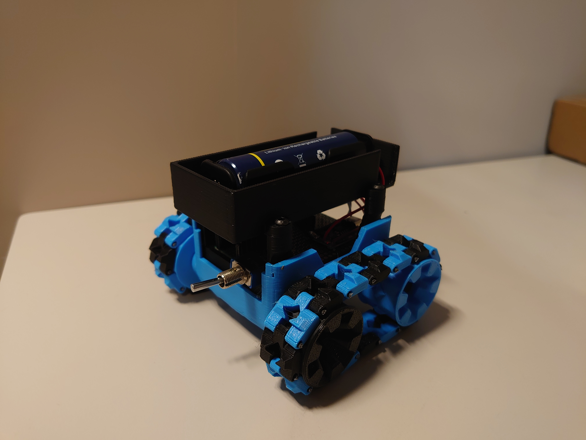
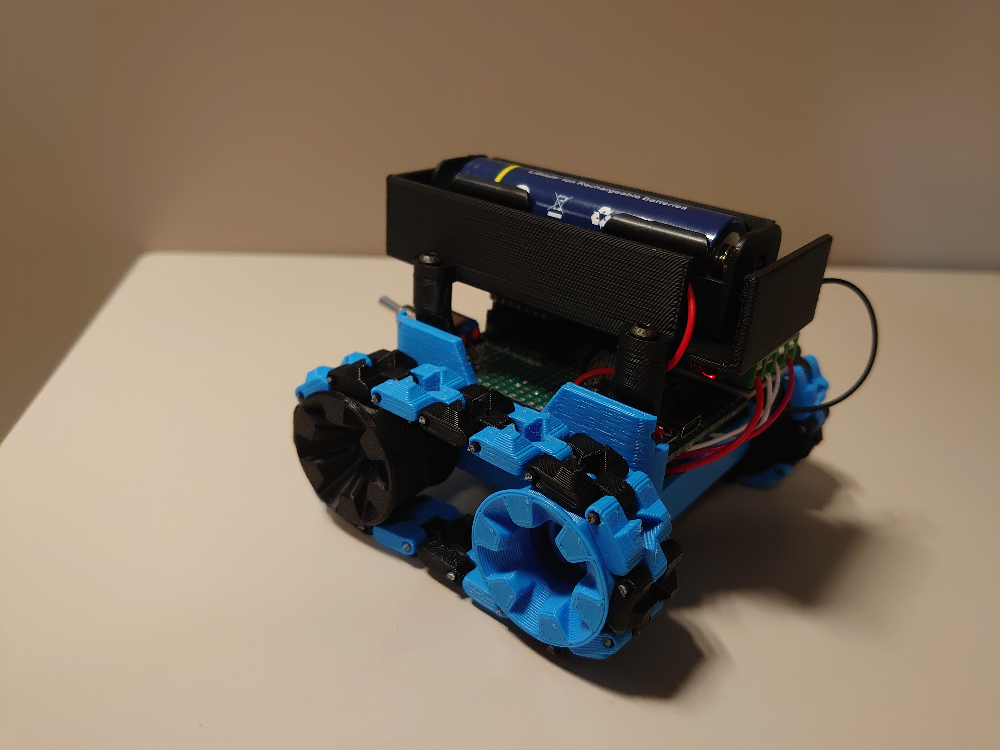
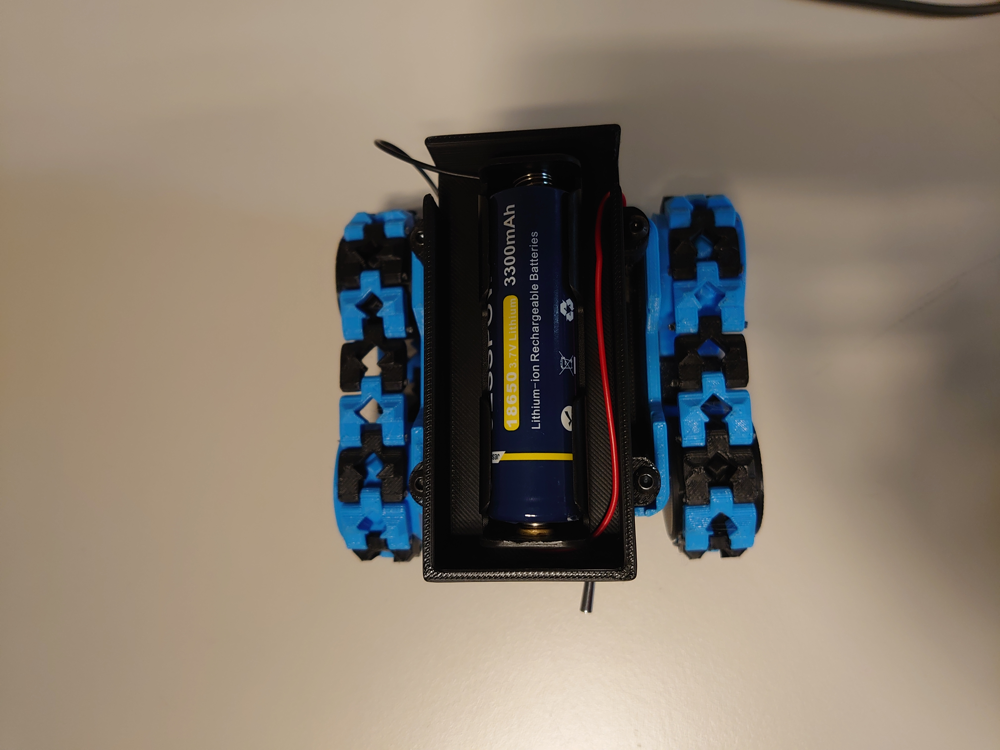
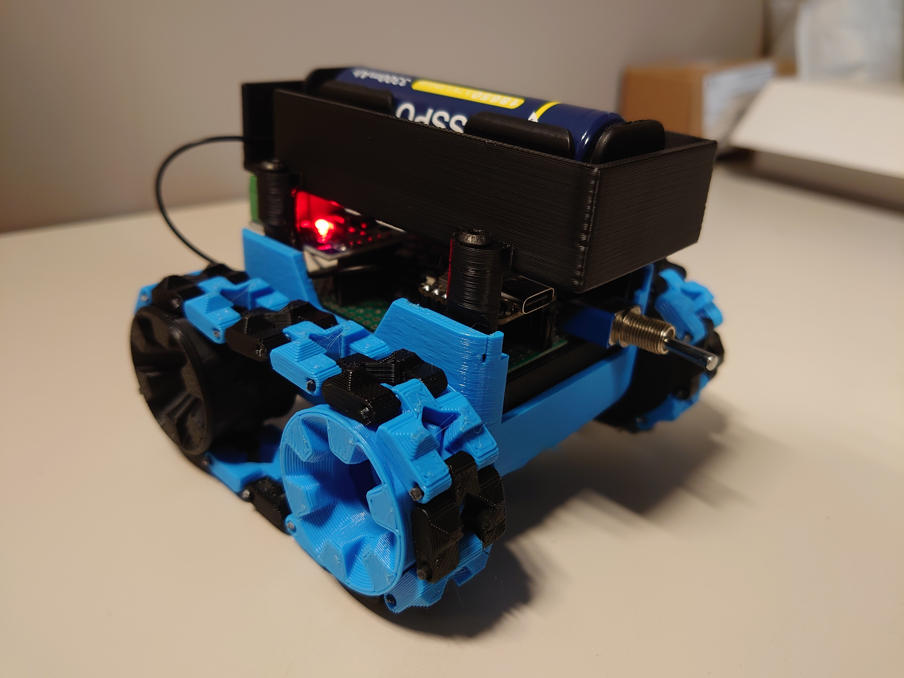

# Build your own mini robot and control it with your arm using muscle contractions (EMG sensor)

|  |  |
|----------------------------------------------|----------------------------------------------|
|  |  |

## Materials
- XIAO ESP32C3  
- L9110S motor driver  
- Two Micro Metal DC Gear Motors 6V 150RPM N20  
- 18650 battery 3.7V 3300mAh  
- TP4056 charger module  
- Power switch  

## 3D Printing
Chassis (round design) by: [Thingiverse - thing:2848238](https://www.thingiverse.com/thing:2848238)

## Code
*(to be added)*

## BLE (Bluetooth Low Energy) Communication

The robot communicates with the control interface via **Bluetooth Low Energy (BLE)** using an **XIAO ESP32C3** microcontroller.  
The ESP32 acts as a **BLE server**, exposing a **GATT characteristic** that receives simple control commands (`F`, `B`, `L`, `R`, `S`) to drive the motors.

| Command | Action      |
|----------|-------------|
| `F`      | Forward     |
| `B`      | Backward    |
| `L`      | Turn Left   |
| `R`      | Turn Right  |
| `S`      | Stop        |

On the computer side, a **Python script** handles communication through the **[Bleak](https://github.com/hbldh/bleak)** library.  
It connects asynchronously to the robot and sends commands via a simple **Tkinter-based GUI**.

For mobile testing or manual communication, the robot can also be controlled using the **nRF Connect** app (available on Android and iOS).  
This allows direct BLE communication without needing a computer.

**Advantages:**
- Fully **wireless** connection (no USB or Wi-Fi required)  
- **Low power** and reliable BLE protocol  
- **Cross-platform compatibility**: works on Linux, Windows, and Android  

---
### 📱 Connecting the Robot via nRF Connect

You can control or test the robot directly from your smartphone using the **nRF Connect** app (available for Android and iOS).

#### Steps to connect:

1. **Open nRF Connect** on your phone.  
2. Make sure **Bluetooth is enabled** and your **robot (ESP32)** is powered on.  
3. In the app, press **"Scan"** to search for nearby BLE devices.  
4. Look for a device named similar to `"ESP32"` or the custom name defined in your code (for example `"MiniCar"`).  
5. Tap **"Connect"**.  
6. Once connected, you’ll see a list of **GATT Services and Characteristics**.  
   - Find the service with UUID:  
     `4fafc201-1fb5-459e-8fcc-c5c9c331914b`  
   - Inside it, locate the **Characteristic UUID**:  
     `beb5483e-36e1-4688-b7f5-ea07361b26a8`  
7. Select this characteristic, tap **"Write"**, choose **"TEXT"**, and send one of the movement commands:
   - `F` → Forward  
   - `B` → Backward  
   - `L` → Turn left  
   - `R` → Turn right  
   - `S` → Stop  

You should see the robot respond immediately.

---

### 🔍 Finding the BLE Addresses

#### 1. **ROBOT_ADDRESS**

This is the **MAC address** of your ESP32 BLE device.  
You can find it using one of the following methods:

- **With nRF Connect:**  
  After scanning, look under the device name — it will appear as something like  
  `24:EC:4A:CE:3F:D6`  
  Copy that value and set it as:  
  ```python
  ROBOT_ADDRESS = "24:EC:4A:CE:3F:D6"
- **From Arduino Serial Monitor:** 
  Add this line in your ESP32 setup to print the address at startup:
  ```python
  Serial.println(BLEDevice::getAddress().toString().c_str());

